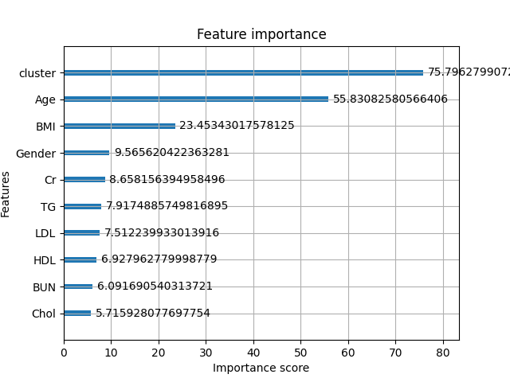
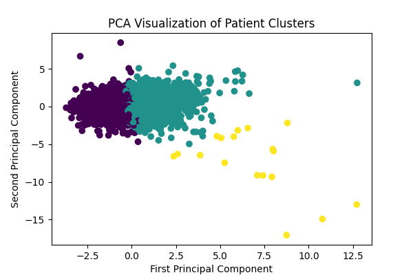

# 📋 Project Overview
A machine learning model for predicting diabetes based on biometric blood-test data, implementing a complete ML workflow from data preprocessing to model deployment.

# 🎯 Project Goals
- Build a clean, reproducible ML pipeline for diabetes prediction
- Evaluate baseline and optimized XGBoost models
- Analyze feature importance in medical context
- Deploy model as web application for easy access
- Ensure clinical relevance by prioritizing recall for positive class

# 📊 Dataset:
**Source**: [health test by blood dataset - Kaggle](https://www.kaggle.com/datasets/simaanjali/diabetes-classification-dataset)
Features:
- Demographics: Age, Gender
- Biometric measurements: BMI, Cholesterol, Triglycerides, HDL, LDL
- Clinical markers: Creatinine, Blood Urea Nitrogen (BUN)

**Target**: Diabetes diagnosis (binary classification)

# 🏗️ Project Structure:
```
diabetes_xgboost_classifier/
├── 📂 data/                    # Datasets (raw and processed)
│   └── Diabetes_Classification.csv          # Raw dataset
│                                            # and all data created by preprocessing
│
├── 📂 models/                  # Trained models (auto-generated)
│   ├── bst_diabetes_classifier_clusters.pkl    # Main classifier
│   ├── scaler.pkl                              # Feature scaler
│   ├── kmeans.pkl                              # Clustering model
│   └── effectiveness_log.json                  # Performance metrics
│
├── 📂 src/                     # Source code
│   ├── preprocessing.py   # Data cleaning and preparation
│   ├── pipeline.py        # Model training pipeline
│   └── tests.py           # Model testing and validation
│
├── 📂 templates/              # Web application HTML templates
│   ├── error.html          # Error page
│   ├── main.html           # Main input form
│   └── results.html        # Prediction results page
│
├── 📂 static/                 # Static assets (CSS, JS, images)
│   └── 📂 css/
│       └── 🧹 style.css
│
├── ⚙️ app.py                  # Main Flask application
├── 📝 requirements.txt        # Python dependencies
├── 📝 README.md              # Project documentation
└── 📂 venv/                  # Python virtual environment
```
# 🚀 Quick Start
## Prerequisites
    Python  3.12.5+
    pip package manager

## Installation
Clone the repository:
```bash

git clone <https://github.com/bartoszstec/diabetes-xgboost-classifier>
cd diabetes_xgboost_classifier
```
Create virtual environment and install dependencies:
```bash

python -m venv venv
source venv/bin/activate  # On Windows: venv\Scripts\activate
pip install -r requirements.txt
```
Download dataset from [Kaggle](https://www.kaggle.com/datasets/simaanjali/diabetes-classification-dataset) and place in 'data' folder.

⚠️ **Disclaimer:** File name of raw dataset should be named: 'Diabetes_Classification.csv'

## Running the Application
Step 1: First-time setup (generates models)
```bash
cd src
python preprocessing.py
python pipeline.py
cd ..
```
Step 2: Launch web application
```bash
python app.py
```
Last step: Access the application at: http://localhost:5000

# 🩺 Clinical Relevance:
- Model prioritizes sensitivity - minimizes false negatives (missed diabetes cases)
- Good trade-off between identifying diabetic patients and avoiding false alarms
- Suitable for screening where catching potential cases is crucial


# 🧠 Machine Learning Approach
## Model Architecture

- Algorithm: XGBoost (Gradient Boosting Decision Trees)
- Loss Function: Binary Cross-Entropy
- Hyperparameter Tuning: Grid Search

## Key Innovations
- Phenotype Clustering: K-means clustering of patient profiles to capture disease subtypes
- Leakage Handling: Identification and removal of samples with data leakage
- Clinical Prioritization: Optimization for high recall in positive class

## Preprocessing Pipeline
- Data normalization
- Handling of data leakage cases
- Feature scaling (StandardScaler)
- Patient phenotype clustering (K-means)
- Feature encoding (gender representation tested with both Label and One-Hot Encoding)

# 📈 Performance & Results
## Performance
|               Metric               |      Overall      | Class 0 (No Diabetes)  | Class 1 (Diabetes) |
|:----------------------------------:|:-----------------:|:---:| :---: |
|            **Accuracy**            |     **81.08%**      | - | - |
|           **Precision**            | **82.50% (weighted)** |   **89.65%**   | **69.50%** |
|             **Recall**             | **81.08% (weighted)** |   **79.90%**   | **83.23%** |
|            **F1-Score**            | **81.39% (weighted)** |   **84.49%**   | **75.75%** |
|       **Support (samples)**        |     941 total     |   607   | 334 |

## Key Insights:
- High recall for diabetic class (83.23%) - model effectively identifies patients with diabetes
- High precision for non-diabetic class (89.65%) - when predicting "no diabetes", it's usually correct
- Balanced performance with weighted F1-score of 81.39%
- Clustering improved recall for the positive class compared to baseline models

## Feature Analysis:
This section shows the relative importance of each input feature in the trained model, calculated using the *gain* metric.

Gain measures how much each feature contributes to improving the model’s predictions when it is used in a split inside the model.



Higher values mean that the feature provides more predictive power to the model.

## Clusters PCA
This plot shows a 2-dimensional visualization of patient clusters created using Principal Component Analysis (PCA).

The model first groups patients based on similarity of their medical profiles (unsupervised clustering).
PCA then compresses the high-dimensional data into two dimensions so it can be visualized.



Each point represents one patient:
- Points close together → patients with similar medical profiles
- Points far apart → significantly different profiles
- Colors (clusters) show distinct patient subgroups

# 🛠 Technoglogies
This project is built using a modern Python-based machine learning and web stack designed for training, serving, and visualizing predictive models.

## Backend & API
- Flask – lightweight and fast web framework used to expose the machine learning model via REST API.
- Jinja2 – templating engine used to render dynamic HTML pages for the frontend.

## Machine Learning & Data Processing
- Scikit-learn – used for data preprocessing, model evaluation, and classical ML pipelines.
- XGBoost – high-performance gradient boosting library used as the main predictive model.
- NumPy – core numerical computing library for efficient array operations.
- Pandas – used for data loading, cleaning, and feature engineering.
- SciPy – scientific computing library supporting optimization and statistics.
- Joblib – model serialization and fast loading of trained models.

## Data Visualization
- Matplotlib – used to generate feature importance plots, PCA projections, and other analytical charts.

# Conclusions from the project:
- In medical classification tasks such as diabetes prediction, overall accuracy is not the most important evaluation metric. A balanced trade-off between precision and recall for each class is crucial, with particular emphasis on recall for the positive class (ill patients). Misclassifying an ill patient as healthy (false negative) is the most critical error, therefore the model should prioritize achieving a high recall for the positive class.
- The use of Label Encoding and One-Hot Encoding for the binary Gender feature did not affect the model’s performance. This behavior is consistent with the properties of tree-based algorithms such as XGBoost, which are insensitive to monotonic transformations of categorical variables. Feature importance analysis further confirmed that gender has only a marginal predictive contribution compared to clinical and biometric features.
- Exploratory data analysis revealed a subset of samples containing identical constant values across multiple independent laboratory features, which resulted in perfect separation of the positive class. This pattern represents severe data leakage, where the target variable is implicitly encoded in the input features, leading to artificially inflated performance metrics. Such samples were excluded from training and evaluation to ensure realistic model behavior and proper generalization.
- Adding a phenotype-based cluster feature significantly improved recall and F1-score for the positive (diabetic) class. Interestingly, representing the cluster as an ordinal variable outperformed one-hot encoding, indicating that the discovered clusters follow a monotonic disease severity progression rather than independent categories.


# 📄 License
This project is licensed under the MIT License.
See the [LICENSE](./LICENSE) file for details.